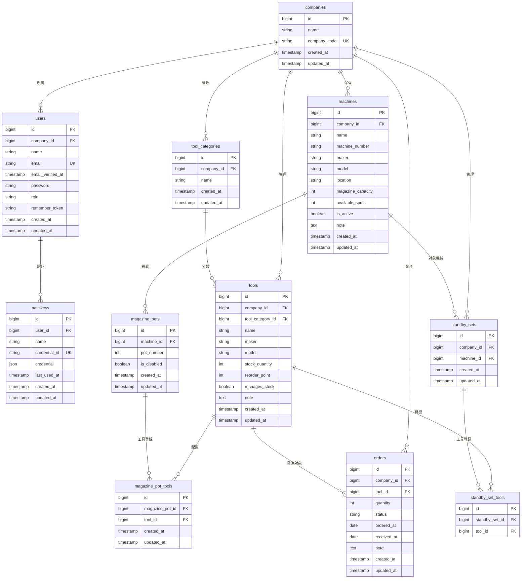

# ER図

```mermaid
erDiagram
    companies {
        bigint id PK
        string name
        string company_code UK
        timestamp created_at
        timestamp updated_at
    }

    users {
        bigint id PK
        bigint company_id FK
        string name
        string email UK
        timestamp email_verified_at
        string password
        string role
        string remember_token
        timestamp created_at
        timestamp updated_at
    }

    passkeys {
        bigint id PK
        bigint user_id FK
        string name
        string credential_id UK
        json credential
        timestamp last_used_at
        timestamp created_at
        timestamp updated_at
    }

    machines {
        bigint id PK
        bigint company_id FK
        string name
        string machine_number
        string maker
        string model
        string location
        int magazine_capacity
        int available_spots
        boolean is_active
        text note
        timestamp created_at
        timestamp updated_at
    }

    tool_categories {
        bigint id PK
        bigint company_id FK
        string name
        timestamp created_at
        timestamp updated_at
    }

    tools {
        bigint id PK
        bigint company_id FK
        bigint tool_category_id FK
        string name
        string maker
        string model
        int stock_quantity
        int reorder_point
        boolean manages_stock
        text note
        timestamp created_at
        timestamp updated_at
    }

    orders {
        bigint id PK
        bigint company_id FK
        bigint tool_id FK
        int quantity
        string status
        date ordered_at
        date received_at
        text note
        timestamp created_at
        timestamp updated_at
    }

    magazine_pots {
        bigint id PK
        bigint machine_id FK
        int pot_number
        boolean is_disabled
        timestamp created_at
        timestamp updated_at
    }

    magazine_pot_tools {
        bigint id PK
        bigint magazine_pot_id FK
        bigint tool_id FK
        timestamp created_at
        timestamp updated_at
    }

    standby_sets {
        bigint id PK
        bigint company_id FK
        bigint machine_id FK
        timestamp created_at
        timestamp updated_at
    }

    standby_set_tools {
        bigint id PK
        bigint standby_set_id FK
        bigint tool_id FK
    }

    companies ||--o{ users : "所属"
    companies ||--o{ machines : "保有"
    companies ||--o{ tool_categories : "管理"
    companies ||--o{ tools : "管理"
    companies ||--o{ orders : "発注"
    companies ||--o{ standby_sets : "管理"

    users ||--o{ passkeys : "認証"

    tool_categories ||--o{ tools : "分類"

    tools ||--o{ orders : "発注対象"
    tools ||--o{ magazine_pot_tools : "配置"
    tools ||--o{ standby_set_tools : "待機"

    machines ||--o{ magazine_pots : "搭載"
    machines ||--o{ standby_sets : "対象機械"

    magazine_pots ||--o{ magazine_pot_tools : "工具登録"

    standby_sets ||--o{ standby_set_tools : "工具登録"
```
